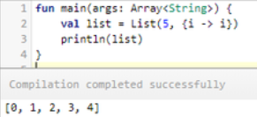
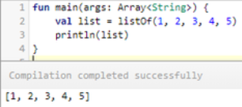
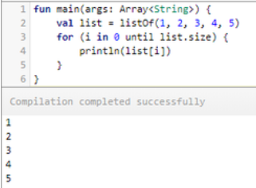
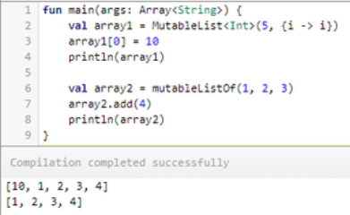
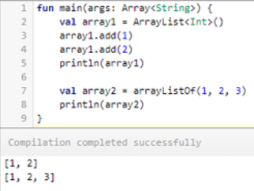
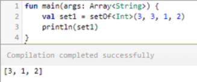
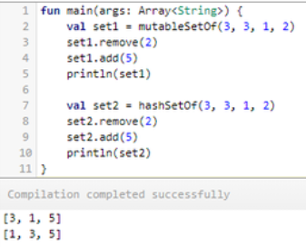
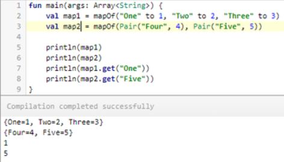
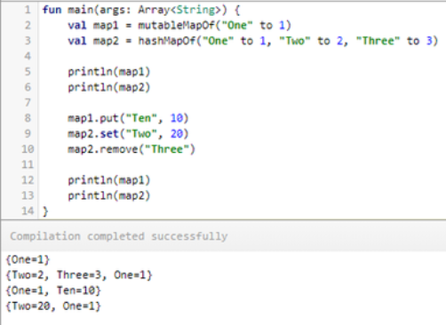

# 코틀린
-------------

## Immutable(불변) / Mutable(가변)
코틀린은 자바와 다르게 Collection을 2종류 타입으로 나눠서 구분 - Immutable / Mutable

**Immutable (불변)**
> Read-Only '읽기전용'의 Collection
     한번 정의되면 수정이 불가 - (add() / put() / remove() 등) 추가, 삭제 불가
     단순하게 추출하는 용도로 사용 

- 생성 함수 (function)
     listOf, setOf, mapOf

**Mutable (가변)**
> Write+Read '읽기/쓰기'의 Collection으로 add / put / remove 등이 가능

- 생성 함수 (function)
     mutableListOf, mutableSetOf, mutableMapOf
     arrayListOf
     hashSetOf, sortedSetOf, linkedSetOf
     hashMapOf, linkedMapOf, sortedMapOf 

**List**

코틀린의 List는 기본적으로 변경 불가능한(Immutable) 방식이다. 생성자에 리스트의 길이와 초기화를 위한 람다 식을 넣어주는 것으로 객체를 생성할 수 있다.
> val list: List<Int> = List(5, {i -> i})

또는 listOf 함수를 이용해서 객체를 생성할 수 있다.

> val list: List<Int> = listOf(1, 2, 3, 4, 5)

List 객체의 각 요소에는 get() 메서드 없이 대괄호("[]" )를 통해 접근할 수 있다.

> val list = listOf(1, 2, 3, 4, 5)
for (i in 0 until list.size) {
    println(list[i])
}

Immutable 타입이기 때문에 대입은 불가능하다.
>val list = listOf(1, 2, 3, 4, 5)
list[0] = 10  // Error

변경 가능한(Mutable) 리스트를 만들기 위해서는  MutableList 또는 ArrayList 클래스를 이용하면 된다. MutableList나 ArrayList 역시 생성자에서 초기화 하는 방법과 mutableListOf(), arrayListOf() 함수를 통해 초기화하는 방법이 있다.
>val array1 = MutableList<Int>(5, {i -> i})
array1[0] = 10
println(array1)
val array2 = mutableListOf(1, 2, 3)
array2.add(4)
println(array2)

>val array1 = ArrayList<Int>()
array1.add(1)
array1.add(2)
println(array1)
val array2 = arrayListOf(1, 2, 3)
println(array2)

***
**Set**

Set은 List와 달리 중복을 허용하지 않으며, 순차적이지 않은 데이터의 집합이다. 마찬가지로 Mutable 타입과 Immutable 타입이 있다. 

Set 클래스는 Immutable 타입이며, 'setOf()' 함수에 의해 생성된다.
>val set1: Set<Int> = setOf<Int>(3, 3, 1, 2)

결과 출력에 '3' 데이터가 중복 제거되어 하나만 있는 것을 확인할 수 있다.

Mutable 타입의 Set은 mutableSetOf, hashSetOf, linkedSetOf, sortedSetOf 등의 함수를 이용해서 만들 수 있으며, 각 함수는 MutableSet<T>, HashSet<T>, LinkedHashSet<T>, TreeSet<T> 객체를 만들어 반환한다.
>val set1: MutableSet<Int> = mutableSetOf(3, 3, 1, 2)
set1.remove(2)
set1.add(5)
println(set1)
val set2: HashSet<Int> = hashSetOf(3, 3, 1, 2)
set2.remove(2)
set2.add(5)
println(set2)

HashSet<T> 객체에서 출력된 순서에 유의하자. HashSet 클래스는 '키' 값의 해시 코드(Hash Code) 순으로 검색된다.
***
**Map**

Map은 '키(Key)'와 '값(Value)'으로 이루어진 한 쌍의 데이터를 관리하기 위한 집합으로, 효율적인 검색을 지원하는 컬렉션이다. 순차적이지 않으며, '키'는 중복될 수 없고 '값'은 중복될 수 있다.

Map은 Immutable 타입이며, mapOf() 함수로 생성된다.
>val map1: Map<String, Int> = mapOf("One" to 1, "Two" to 2, "Three" to 3)
val map2: Map<String, Int> = mapOf(Pair("Four", 4), Pair("Five", 5))

Mutable 타입의 Map은 mutableMapOf, hashMapOf, linkedMapOf, sortedMapOf 등의 함수에 의해 생성되며, 각각 MutableMap<K, V>, HashMap<K, V>, LinkedHashMap<K, V>, SortedMap<K, V> 객체를 만들어 반환한다.
>val map1: MutableMap<String, Int> = mutableMapOf("One" to 1)
val map2: HashMap<String, Int> = hashMapOf("One" to 1, "Two" to 2, "Three" to 3)
map1.put("Ten", 10)
map2.set("Two", 20)
map2.remove("Three")

HashMap 역시 '키' 값의 해시 코드 순으로 출력된 것에 유의하자. 

***
**요약**

컬렉션  | Immutable 타입  | Mutable 타입
----|--------|--------
List | listOf   | mutableListOf, arrayListOf
Set	 | setOf    | mutableSetOf, hashSetOf, linkedSetOf, sortedSetOf
Map | mapOf | mutableMapOf, hashMapOf, linkedMapOf, sortedMapOf
